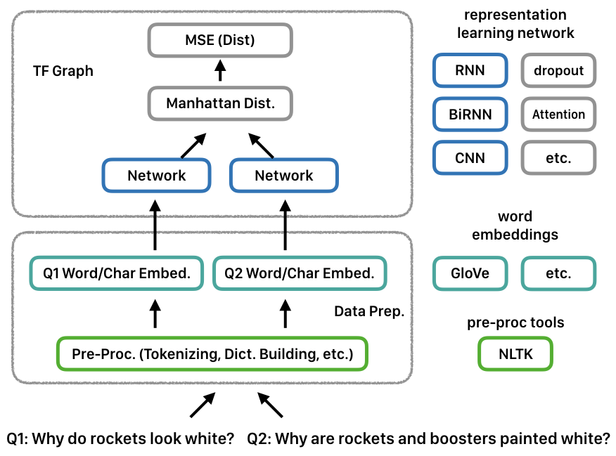
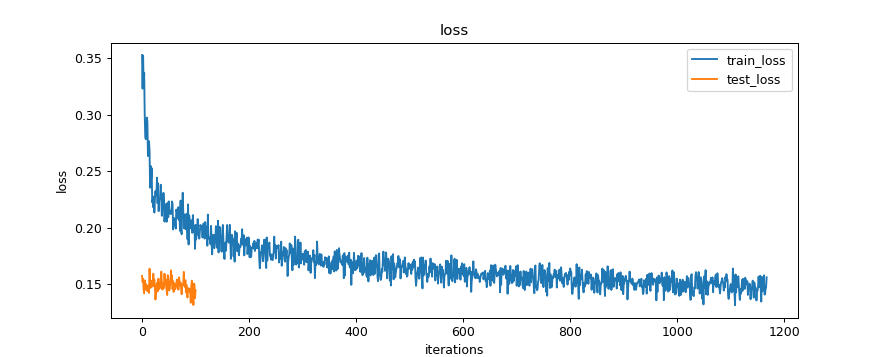
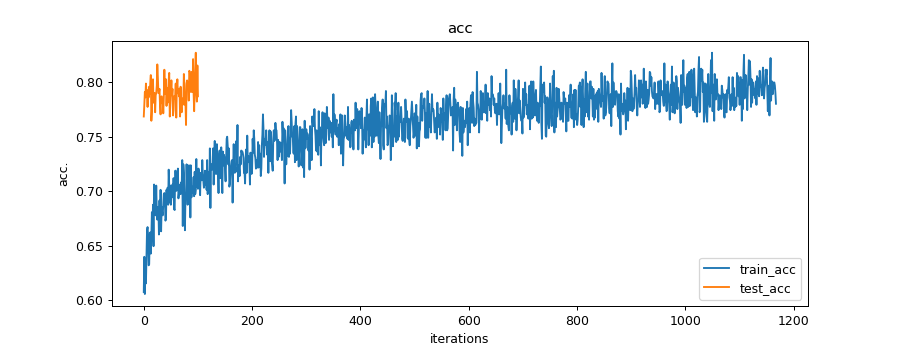

# Siamese Neural Network in Tensorflow
- Tensorflow Implementation of Siamese Neural Network for Learning Sentence Similarity
- Original Pub. : http://mit.edu/~jonasm/info/MuellerThyagarajan_AAAI16.pdf

## motivations

- Since recurrent neural network (RNN) can be used as a medium for implementing wide-range of computation problem by tuning its weight, original authors suggest using two RNNs to learn representations of semantically coherent sentences.
- Two RNNs shares the same weight parameters to produce similar geometric output reflects their similarity relationship.
- Consider following semantically similar sentences: `Why do rockets look white?` and `Why are rockets and boosters painted white?`. In this case, weights of networks are adjusted to optimal medium for minimizing manhattan distance of final hidden state in each network.
> The language representation is derived from a pre-trained word vector (similar word has represented in similar numeric values) helpful for networks to adjust their weight minimally (therefore expressively) when processing similar sentences.

### program design

- Like much of natural language processing projects in Tensorflow, the program is comprised of three parts: pre-processing part to tokenizing and indexing input data, embedding part to transform language input to vector representation, and network part to manipulate input vector representations.
> - In the pre-processing part, we use NLTK tokenizer to split sentences into a series of words and building words dictionary by mapping them from pre-trained word embedding values.
> - In the embedding part, each word of input sentences is translated into a series of vectors using the dictionary from the previous part.
> - In network part, identical network with shared weight parameter is used to processing different but semantically similar representation. Throughout the training iterations, their weights are gradually optimized to process series of word input from semantically similar sentences.
- The Manhattan distance between hidden state vector of networks determines similarity prediction. ( refer above paper to details )

### data preps.
- [Quora Questions Pairs Datasets](https://www.kaggle.com/c/quora-question-pairs/)
> - Download https://www.kaggle.com/c/quora-question-pairs/data
> - Unzip to obtain `all` folder under `siamese-nn-files` folder
> - Split train data into train and test sets:
> - `split -l 200000 && mv xaa train-temp.csv && mv xab test-temp.csv`

- [GloVE - Pre-trained Word-Vector Representations](https://nlp.stanford.edu/projects/glove/)
> - Download http://nlp.stanford.edu/data/glove.840B.300d.zip ( Common Crawl (840B tokens, 2.2M vocab, cased, 300d vectors, 2.03 GB download) )
> - Unzip to obtain `glove.840B.300d.txt` under `siamese-nn-files` folder

### options (constants in source code)
- `train_data_max_epoch`: define training epoch
> default: 5
- `TRAIN_SINGLE_DATA_ITER`: define training batch size
> default: 1024
- `TEST_SINGLE_DATA_ITER`: define test batch size
> default: 1024
- `RNN_DIMENSION`: define rnn dimensions and number of layers (e.g. [50, 50])
> default: [50]
- `DROPOUT_PERCENTILE`: define dropout percentile (e.g. 0.5 [reference](https://www.tensorflow.org/api_docs/python/tf/nn/rnn_cell/DropoutWrapper))
> default: 1 (no dropout)
- `USING_PRE_TRAINED_VECTOR`: use pre-trained GloVE word vectors
> default: True
- `USE_CHAR_EMBEDDING`: use char-level embedding in addition to word-level embedding
> default: False
- `USE_LSTM_CELL`: use LSTM cell
> default: True (False to use GRU cell)

## train and test results

### mean-squared error losses

### accuracies

## w-w/o exp. lists
- [ ] pre-trained word embeddings
- [ ] dropout
- [ ] bidirectional
- [ ] cnn-basis
- [ ] data analysis
- [ ] hierarchical attention rnn

## reference impls.
- Keras
  - https://github.com/eliorc/Medium/blob/master/MaLSTM.ipynb
  > [Medium Article : How to predict Quora Question Pairs using Siamese Manhattan LSTM](https://medium.com/mlreview/implementing-malstm-on-kaggles-quora-question-pairs-competition-8b31b0b16a07)
